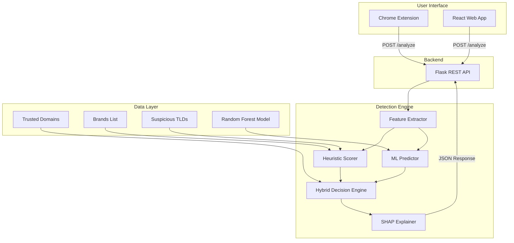

<p align="center">
  
</p>

<h1 align="center">PhishScope</h1>

<p align="center">
  <strong>AI-Powered Hybrid Phishing URL Detection Platform</strong>
</p>

<p align="center">
  
  
  
  
  
  
  
  
</p>

---

PhishScope is a cybersecurity URL analysis and phishing detection platform that combines **machine learning classification**, **heuristic URL analysis**, and a **hybrid decision engine** to identify potentially malicious websites before users interact with them. It provides real-time browser protection through a Chrome extension, a web-based URL analyzer, and human-readable explanations powered by SHAP (SHapley Additive exPlanations).

---

## Table of Contents

- [Overview](#overview)
- [Problem Statement](#problem-statement)
- [Key Features](#key-features)
- [System Architecture](#system-architecture)
- [Detection Pipeline](#detection-pipeline)
- [Machine Learning Pipeline](#machine-learning-pipeline)
- [Heuristic Scoring Engine](#heuristic-scoring-engine)
- [Hybrid Detection Engine](#hybrid-detection-engine)
- [Explainable AI (XAI)](#explainable-ai-xai)
- [Chrome Extension](#chrome-extension)
- [React Frontend](#react-frontend)
- [Flask Backend / API](#flask-backend--api)
- [Project Structure](#project-structure)
- [Technologies Used](#technologies-used)
- [Dataset and Model Training](#dataset-and-model-training)
- [Model Evaluation](#model-evaluation)
- [Security Verdicts and Detection Levels](#security-verdicts-and-detection-levels)
- [Installation](#installation)
- [Running the Project](#running-the-project)
- [Using the Web Application](#using-the-web-application)
- [Using the Chrome Extension](#using-the-chrome-extension)
- [Testing](#testing)
- [Current Limitations](#current-limitations)
- [Future Improvements](#future-improvements)
- [Development Journey](#development-journey)
- [Resume-Ready Project Description](#resume-ready-project-description)
- [Author](#author)

---

## Overview

PhishScope is a full-stack cybersecurity platform designed to detect phishing and malicious URLs using a multi-layered analysis approach. Rather than relying on a single detection mechanism, PhishScope combines three complementary analysis layers:

| Layer | Technique | Purpose |
|-------|-----------|---------|
| **Heuristic Analysis** | Rule-based scoring of URL structure | Catches known phishing patterns (brand impersonation, suspicious TLDs, URL obfuscation) |
| **Machine Learning** | Random Forest classifier trained on 100,000+ URLs | Generalizes to detect unseen phishing patterns using 18 extracted features |
| **Hybrid Decision Engine** | Weighted consensus with override rules | Resolves conflicts between heuristic and ML layers with confidence-aware logic |

Every analysis also generates a **SHAP-based explanation** that translates the model's decision into human-readable language, making PhishScope not just a detection tool but an **explainable** one.

---

## Problem Statement

Phishing remains one of the most prevalent cybersecurity threats. Attackers use increasingly sophisticated techniques to disguise malicious URLs:

- **Brand impersonation** — domains containing `paypal`, `microsoft`, or `amazon` in misleading positions
- **Suspicious TLDs** — registering domains under free or high-risk TLDs (`.xyz`, `.tk`, `.ml`, `.ga`)
- **URL obfuscation** — excessive subdomains, hyphens, path depth, and special characters
- **Lookalike attacks** — Unicode homographs (`pаypal.com` using Cyrillic `а`) and ASCII substitutions (`g00gle.com`)
- **Phishing keywords** — paths containing `login`, `verify`, `account`, `secure`, `confirm`, `billing`
- **IP address hosting** — serving phishing pages from raw IP addresses instead of domain names

Relying on a single detection mechanism is insufficient:

- **Heuristic-only** approaches miss novel phishing patterns that don't match predefined rules
- **ML-only** approaches can produce false positives on legitimate sites with unusual URL structures
- **Blacklist-only** approaches cannot detect zero-day phishing sites

PhishScope addresses this by combining heuristic pattern matching, machine learning classification, and a hybrid consensus engine — producing a three-tier verdict system (**SAFE**, **SUSPICIOUS**, **DANGEROUS**) with confidence levels and human-readable explanations.

---

## Key Features

### Machine Learning Detection
- Random Forest classifier with **98.55% accuracy** on a balanced 20,000-sample test set
- 18 lexical and structural features extracted from URL text alone (no network requests during feature extraction)
- Probability estimation for confidence-aware decision making
- Model benchmarking across Random Forest, Decision Tree, Logistic Regression, and SVM

### Heuristic Scoring Engine
- Rule-based scoring across 10 detection rules
- IP address detection, brand mismatch analysis, lookalike detection (ASCII, Unicode, Punycode)
- Shannon entropy calculation for randomness detection
- Suspicious TLD scoring with tiered risk levels (high / medium)
- Phishing keyword detection in URL paths and hostnames
- Configurable scoring thresholds and point values

### Hybrid Detection Engine
- Weighted consensus formula: `(heuristic_score × 0.4) + (ml_probability × 100 × 0.6)`
- Six override rules handling agreement, conflict, and edge cases between engines
- Tiered corroboration thresholds to minimize false positives
- Trusted domain bypass for known-safe domains (Google, GitHub, Amazon, etc.)

### Explainable AI (SHAP)
- SHAP `TreeExplainer` for per-prediction feature importance
- Human-readable explanations mapping raw feature names to natural language
- Duplicate explanation filtering for cleaner output
- Three explanation levels with context-aware summary generation

### Web Application
- React 19 single-page application with responsive design
- URL analyzer with real-time results display
- Dashboard with analysis history and statistics
- Comprehensive documentation page
- Verdict visualization with confidence indicators and SHAP explanations

### Chrome Extension
- Manifest V3 with background service worker
- **Always-on URL interception** — every navigation is analyzed before the page loads
- Interstitial "analyzing" page while the backend processes the URL
- Tiered warning pages: SUSPICIOUS (single-click continue) and DANGEROUS (3-step confirmation)
- In-memory temporary whitelist for user-approved URLs
- Browser notification system for dangerous site detection
- Analysis history tracking via `chrome.storage.local`
- Safe site toast notifications injected via `chrome.scripting`
- Trusted domain fast-path with visual badge

---

## System Architecture



### Communication Flow

1. **Chrome Extension** intercepts every browser navigation via `chrome.webNavigation.onBeforeNavigate`
2. The browser is immediately redirected to an internal `analyzing.html` interstitial page
3. The extension's `analyzing.js` sends the URL to the background service worker
4. The background service worker calls `POST /analyze` on the Flask backend
5. The backend runs the full detection pipeline (features → heuristic + ML → hybrid → XAI)
6. The verdict is returned as JSON; the extension routes the user to the appropriate page:
   - **SAFE** → navigate to the original URL + show a green toast notification
   - **SUSPICIOUS** → show a warning page with a single-click continue option
   - **DANGEROUS** → show a danger page with a 3-step confirmation flow

The **React web application** communicates with the same Flask API endpoint, providing a browser-based URL analyzer interface.

---

## Detection Pipeline

```
URL Input
    │
    ▼
┌─────────────────────────┐
│   Trusted Domain Check  │──── SAFE (bypass all analysis)
└─────────────────────────┘
    │ (not trusted)
    ▼
┌─────────────────────────┐
│   Feature Extraction    │  18 lexical features from URL string
└─────────────────────────┘
    │
    ├──────────────────────────────┐
    ▼                              ▼
┌──────────────┐          ┌──────────────────┐
│  Heuristic   │          │  ML Prediction   │
│  Scoring     │          │  (Random Forest) │
│  (10 rules)  │          │  (18 features)   │
└──────────────┘          └──────────────────┘
    │                              │
    ▼                              ▼
┌─────────────────────────────────────────┐
│        Hybrid Decision Engine           │
│  • Weighted score formula               │
│  • 6 override rules                     │
│  • Confidence-aware thresholds          │
└─────────────────────────────────────────┘
    │
    ▼
┌─────────────────────────┐
│   SHAP Explanation      │  Feature importance → human-readable text
└─────────────────────────┘
    │
    ▼
┌─────────────────────────┐
│   Final Verdict         │  SAFE / SUSPICIOUS / DANGEROUS
│   + Confidence Level    │  LOW / MEDIUM / HIGH / VERY_HIGH
│   + Explanation         │  Summary + top contributing features
└─────────────────────────┘
```

---

## Machine Learning Pipeline

### Feature Extraction

PhishScope extracts **18 features** from each URL using lexical and structural analysis only (no DNS lookups or page content fetching):

| Feature | Description |
|---------|-------------|
| `url_length` | Total character count of the URL |
| `dot_count` | Number of dots in the hostname |
| `hyphen_count` | Number of hyphens in the hostname |
| `has_ip_address` | Whether the host is an IP address |
| `has_at_symbol` | Presence of `@` in the URL |
| `subdomain_count` | Number of subdomain levels |
| `uses_https` | Whether the URL uses HTTPS |
| `digit_ratio` | Proportion of digits in the hostname |
| `token_count` | Tokens in the hostname split by `.` and `-` |
| `shannon_entropy` | Shannon entropy of the registered domain |
| `high_entropy` | Boolean flag if entropy exceeds threshold |
| `tld_risk_points` | Risk score of the top-level domain |
| `brand_mismatch` | Brand name found in a suspicious position |
| `brand_risk_points` | Points assigned for brand-related risk |
| `ascii_lookalike_detected` | ASCII character substitution detected |
| `unicode_confusable_detected` | Unicode homograph characters detected |
| `punycode_detected` | Internationalized domain using Punycode |
| `lookalike_risk_points` | Points for lookalike domain detection |

### Training Pipeline

```
Raw Datasets (phishing.csv + legitimate_urls.csv)
    │
    ▼
datasets/scripts/clean.py          ── Deduplication, validation, normalization
    │
    ▼
datasets/scripts/build_features.py ── Extract 18 features per URL
    │
    ▼
datasets/scripts/balance.py        ── Balance classes (50/50 safe/phishing)
    │
    ▼
datasets/scripts/split.py          ── 80/20 stratified train/test split
    │
    ▼
ml/scripts/train.py                ── Train Random Forest (100 trees)
    │
    ▼
ml/scripts/evaluate.py             ── Generate metrics, confusion matrix, ROC curve
    │
    ▼
ml/models/best_model.pkl           ── Serialized model (~20 MB)
```

### Model Comparison

| Model | Training Accuracy |
|-------|:-:|
| **Random Forest** | **99.36%** |
| Decision Tree | 99.36% |
| Logistic Regression | 97.11% |
| SVM (Linear) | 96.88% |

The Random Forest classifier was selected for its strong generalization characteristics and native support for feature importance and probability estimation.

---

## Heuristic Scoring Engine

The heuristic engine applies **10 configurable rules** and produces a score from 0 to 100:

| Rule | Points | Trigger Condition |
|------|:------:|-------------------|
| IP Address Detection | 25 | Host is a raw IPv4/IPv6 address |
| High Entropy | 20 | Shannon entropy > 3.5 |
| Brand Mismatch | 20 | Known brand name in a suspicious URL position |
| Phishing Keywords | 20 | 2+ keywords like `login`, `verify`, `account`, `secure` |
| Suspicious TLD | 15 | TLD in high/medium risk category |
| Lookalike Domain | 15 | ASCII substitution, Unicode homograph, or Punycode |
| Excessive Hyphens | 10 | 3+ hyphens in hostname |
| Excessive Subdomains | 10 | 4+ subdomain levels |
| `@` Symbol | 10 | `@` found in URL (credential injection) |
| Long URL | 5 | URL exceeds 75 characters |

**Score Bands:**

| Score | Verdict |
|:-----:|---------|
| 0–30 | SAFE |
| 31–60 | SUSPICIOUS |
| 61–100 | DANGEROUS |

---

## Hybrid Detection Engine

The hybrid engine resolves disagreements between the heuristic and ML layers using **weighted scoring** and **override rules**.

### Hybrid Score Formula

```
hybrid_score = (heuristic_score × 0.4) + (ml_phishing_probability × 100 × 0.6)
```

### Decision Rules

| # | Heuristic | ML | Result | Rationale |
|:-:|-----------|:--:|--------|-----------|
| 1 | DANGEROUS | PHISHING | **DANGEROUS** (VERY_HIGH) | Full consensus |
| 2 | SAFE | SAFE | **SAFE** (HIGH) | Full consensus |
| 3 | SAFE | PHISHING | Depends on score | Tiered: ≤15 → SAFE, 16–35 → SUSPICIOUS if high ML confidence, >35 → DANGEROUS |
| 4 | DANGEROUS | SAFE | Depends on score | ≥35 → DANGEROUS (novel pattern), <35 → SUSPICIOUS |
| 5 | SUSPICIOUS | PHISHING | **DANGEROUS** (HIGH) | Corroboration escalation |
| 6 | SUSPICIOUS | SAFE | **SUSPICIOUS** (LOW) | Caution without escalation |

### Trusted Domain Bypass

URLs matching domains in `backend/data/trusted_domains.txt` (Google, GitHub, Amazon, Microsoft, etc.) skip all analysis and return `SAFE` immediately. This covers exact matches and subdomain matching (e.g., `docs.google.com` → `google.com` → trusted).

---

## Explainable AI (XAI)

PhishScope uses **SHAP (SHapley Additive exPlanations)** with a `TreeExplainer` optimized for tree-based models to explain every prediction.

### How It Works

1. After the hybrid verdict is determined, the feature vector is passed to the SHAP explainer
2. SHAP calculates per-feature contribution values for the phishing class
3. The top 3 features by absolute SHAP value are selected
4. Raw feature names are mapped to human-readable explanations via `xai/human_explanations.py`
5. A natural language summary is generated based on the verdict and top indicators

### Example Output

```json
{
  "explanation": {
    "summary": "This URL was classified as phishing primarily due to a long and complex url and a complex subdomain structure.",
    "top_features": [
      { "feature": "This website uses a very long address, which is sometimes seen in phishing attacks.", "impact": "+36%" },
      { "feature": "The website address has a complex structure.", "impact": "+21%" },
      { "feature": "The website address has an unusual structure with many separators.", "impact": "+18%" }
    ]
  }
}
```

---

## Chrome Extension

The PhishScope Chrome Extension (Manifest V3) provides **always-on browser protection** that intercepts every navigation automatically.

### Architecture

| Component | File | Purpose |
|-----------|------|---------|
| Service Worker | `background.js` | Intercepts navigations, calls Flask API, routes to warning pages |
| Analyzing Page | `analyzing.html/js/css` | Interstitial loading page shown during analysis |
| Suspicious Page | `suspicious.html/js/css` | Single-click continue warning for suspicious URLs |
| Warning Page | `warning.html/js/css` | 3-step confirmation flow for dangerous URLs |
| Popup | `popup.html/js/css` | Extension popup with results, stats, and history |
| API Utility | `utils/api.js` | Fetch wrapper for backend communication |

### Interception Flow

```
User navigates to URL
    │
    ▼
background.js (onBeforeNavigate)
    │
    ├── Internal page? ──→ Skip (chrome://, about:, etc.)
    ├── Whitelisted?   ──→ Allow navigation
    │
    ▼
Redirect to analyzing.html
    │
    ▼
analyzing.js → background.js → POST /analyze
    │
    ├── SAFE       ──→ Navigate to URL + show green toast
    ├── SUSPICIOUS ──→ Show suspicious.html (1-click continue)
    └── DANGEROUS  ──→ Show warning.html (3-step confirmation)
```

### Security Features

- **Pre-navigation blocking** — the original HTTP request is aborted before the malicious page loads
- **3-step confirmation** for dangerous sites — users must click "Continue Anyway" three times through modal confirmations
- **In-memory whitelist** — cleared on browser restart; only populated by explicit user action
- **Server-side redirect detection** — `onCommitted` listener catches redirects that bypass `onBeforeNavigate`

---

## React Frontend

The web application is built with **React 19**, **Vite**, and **Tailwind CSS**.

### Pages

| Route | Page | Description |
|-------|------|-------------|
| `/` | Home | Landing page with hero section and project overview |
| `/analyzer` | Analyzer | URL input form with real-time analysis results |
| `/dashboard` | Dashboard | Analysis history, statistics, and recent results |
| `/docs` | Documentation | Comprehensive system documentation |
| `/about` | About | Project information and team details |

### Key Components

- **`AnalyzerForm`** — URL input with validation and submission
- **`ResultCard`** — Analysis result display with verdict badge
- **`VerdictBadge`** — Color-coded verdict indicator (green/amber/red)
- **`ExplanationCard`** — SHAP explanation with feature impact display
- **`Navbar`** / **`Footer`** — Responsive navigation and site footer

---

## Flask Backend / API

The backend is a Flask REST API with CORS support, serving as the single communication layer between all clients and the detection engine.

### Endpoints

| Method | Endpoint | Description |
|--------|----------|-------------|
| `GET` | `/` | API metadata and status |
| `GET` | `/health` | Health check for monitoring |
| `POST` | `/analyze` | **Core endpoint** — accepts `{ "url": "..." }`, returns full analysis |

### Analyze Response Shape

```json
{
  "heuristic": {
    "score": 45,
    "verdict": "SUSPICIOUS",
    "confidence": "MEDIUM",
    "triggered_rules": 3,
    "reasons": ["Brand mismatch detected.", "Multiple phishing keywords detected in URL.", "Suspicious TLD (.xyz)."],
    "features": { "..." }
  },
  "ml": {
    "prediction": "PHISHING",
    "confidence": 0.9823
  },
  "hybrid": {
    "score": 77,
    "verdict": "DANGEROUS",
    "confidence": "HIGH",
    "reasons": ["Suspicious heuristics corroborated by ML phishing prediction."],
    "trusted_domain": false,
    "decision_source": "hybrid"
  },
  "explanation": {
    "summary": "This URL was classified as phishing primarily due to a long and complex url.",
    "top_features": [
      { "feature": "This website uses a very long address...", "impact": "+36%" }
    ]
  }
}
```

---

## Project Structure

```
PhishScope/
├── backend/                    # Flask API and analysis engine
│   ├── analyzer/               # Core analysis modules
│   │   ├── feature_extractor.py    # 18-feature URL extraction
│   │   ├── scoring_engine.py       # 10-rule heuristic scorer
│   │   ├── brand_checker.py        # Brand position analysis
│   │   ├── entropy.py              # Shannon entropy calculation
│   │   ├── lookalike.py            # ASCII/Unicode/Punycode detection
│   │   └── tld_scorer.py           # TLD risk classification
│   ├── data/                   # Static data files
│   │   ├── brands.txt              # 19 monitored brand names
│   │   ├── suspicious_tlds.txt     # 23 high/medium risk TLDs
│   │   └── trusted_domains.txt     # 25 trusted domain bypass list
│   ├── utils/                  # Utility modules
│   │   ├── trusted_loader.py       # Trusted domain lookup
│   │   ├── loaders.py              # Data file loaders
│   │   └── validators.py           # URL validation
│   ├── tests/                  # Backend test suite
│   ├── app.py                  # Flask application entry point
│   └── config.py               # Centralized configuration
│
├── ml/                         # Machine Learning pipeline
│   ├── scripts/
│   │   ├── train.py                # Model training (RF, DT, LR, SVM)
│   │   ├── predict.py              # Prediction pipeline
│   │   ├── evaluate.py             # Metrics, ROC, confusion matrix
│   │   ├── augment_false_positives.py  # FP reduction pipeline
│   │   └── common.py              # Shared paths and utilities
│   ├── models/
│   │   ├── best_model.pkl          # Trained Random Forest (~20 MB)
│   │   └── model_metadata.json     # Training metadata
│   ├── evaluation/             # Generated evaluation artifacts
│   │   ├── metrics.json            # Accuracy, precision, recall, F1, AUC
│   │   ├── classification_report.txt
│   │   ├── confusion_matrix.png
│   │   ├── roc_curve.png
│   │   ├── feature_importance.csv
│   │   └── model_comparison.csv
│   └── tests/
│
├── hybrid/                     # Hybrid Detection Engine
│   ├── engine.py                   # Main orchestrator
│   ├── decision_tree.py            # 6-rule override logic
│   ├── confidence.py               # Confidence level calculation
│   ├── utils.py                    # Score formula and verdict bands
│   ├── evaluation/
│   │   └── accuracy_comparison.py  # Heuristic vs ML vs Hybrid comparison
│   └── tests/
│
├── xai/                        # Explainable AI module
│   ├── explainer.py                # SHAP TreeExplainer wrapper
│   ├── formatter.py                # Explanation text formatter
│   ├── human_explanations.py       # Feature-to-language mapping
│   ├── utils.py                    # Feature name humanization
│   ├── charts.py                   # SHAP visualization
│   ├── evaluation/
│   └── tests/
│
├── datasets/                   # Dataset preparation pipeline
│   ├── scripts/
│   │   ├── clean.py                # Deduplication and normalization
│   │   ├── build_features.py       # Feature extraction at scale
│   │   ├── balance.py              # Class balancing
│   │   └── split.py                # Train/test splitting
│   ├── raw/                    # Raw source data
│   ├── processed/              # Cleaned data
│   ├── features/               # Feature-engineered data
│   ├── splits/                 # Train/test splits
│   └── tests/
│
├── frontend/                   # React web application
│   ├── src/
│   │   ├── components/             # 11 reusable React components
│   │   ├── pages/                  # 6 pages (Home, Analyzer, Dashboard, Docs, About, 404)
│   │   ├── services/api.js         # Axios-based API client
│   │   ├── App.jsx                 # Router configuration
│   │   └── index.css               # Global styles
│   ├── tests/                  # Vitest test suite
│   ├── package.json
│   ├── tailwind.config.js
│   └── vite.config.js
│
├── extension/                  # Chrome Extension (Manifest V3)
│   ├── background.js               # Service worker (navigation interception)
│   ├── popup.html/js/css            # Extension popup UI
│   ├── analyzing.html/js/css        # Analysis interstitial page
│   ├── suspicious.html/js/css       # Suspicious URL warning page
│   ├── warning.html/js/css          # Dangerous URL warning page
│   ├── content.js                   # Content script stub
│   ├── utils/api.js                 # Backend API fetch wrapper
│   ├── icons/                       # Extension icons (16/48/128px + logo)
│   ├── manifest.json                # Manifest V3 configuration
│   └── tests/
│
└── requirements.txt            # Python dependencies
```

---

## Technologies Used

### Backend
| Technology | Version | Purpose |
|------------|:-------:|---------|
| Python | 3.11+ | Primary backend language |
| Flask | 3.0+ | REST API framework |
| Flask-CORS | 4.0+ | Cross-origin request handling |
| scikit-learn | 1.5+ | Machine learning (Random Forest) |
| SHAP | 0.45+ | Explainable AI |
| pandas | 2.2+ | Data manipulation |
| NumPy | 1.26+ | Numerical computation |
| joblib | 1.3+ | Model serialization |
| tldextract | 5.1+ | Domain parsing |
| matplotlib | 3.8+ | Evaluation visualizations |

### Frontend
| Technology | Version | Purpose |
|------------|:-------:|---------|
| React | 19 | UI framework |
| Vite | 5.2+ | Build tool and dev server |
| Tailwind CSS | 3.4+ | Utility-first styling |
| Axios | 1.7+ | HTTP client |
| React Router | 6.23+ | Client-side routing |
| Recharts | 2.12+ | Data visualization |
| Vitest | 1.6+ | Testing framework |

### Extension
| Technology | Version | Purpose |
|------------|:-------:|---------|
| Chrome Extensions | Manifest V3 | Browser extension platform |
| Service Workers | — | Background script architecture |
| Chrome APIs | — | `webNavigation`, `tabs`, `storage`, `scripting`, `notifications` |

---

## Dataset and Model Training

### Source Data

The model was trained on a combined dataset of **phishing and legitimate URLs** sourced from publicly available cybersecurity datasets.

### Preparation Pipeline

1. **Cleaning** (`datasets/scripts/clean.py`) — removes duplicates, validates URL format, normalizes schemes
2. **Feature Engineering** (`datasets/scripts/build_features.py`) — extracts 18 features per URL
3. **Balancing** (`datasets/scripts/balance.py`) — ensures 50/50 class distribution to prevent bias
4. **Splitting** (`datasets/scripts/split.py`) — stratified 80/20 train/test split

### Training

The model is trained using `ml/scripts/train.py`:

```bash
cd backend
python -m ml.scripts.train --benchmark
```

In benchmark mode, four algorithms are compared and the best performer is saved as `best_model.pkl`.

---

## Model Evaluation

### Test Set Metrics (20,000 balanced samples)

| Metric | Score |
|--------|:-----:|
| **Accuracy** | **98.55%** |
| Precision | 98.99% |
| Recall | 98.09% |
| F1 Score | 98.54% |
| ROC AUC | 99.59% |

### Classification Report

```
              precision    recall  f1-score   support
        Safe       0.98      0.99      0.99     10000
    Phishing       0.99      0.98      0.99     10000
    accuracy                           0.99     20000
```

### Top Features by Importance

| Rank | Feature | Importance |
|:----:|---------|:----------:|
| 1 | URL Length | 35.86% |
| 2 | Subdomain Count | 20.83% |
| 3 | Shannon Entropy | 17.65% |
| 4 | Dot Count | 9.95% |
| 5 | Token Count | 8.59% |

Evaluation artifacts (confusion matrix, ROC curve, feature importance) are stored in `ml/evaluation/`.

---

## Security Verdicts and Detection Levels

### Verdict Tiers

| Verdict | Color | Action |
|---------|:-----:|--------|
| **SAFE** | 🟢 Green | Navigate to site, show confirmation toast |
| **SUSPICIOUS** | 🟡 Amber | Show warning page, single-click continue |
| **DANGEROUS** | 🔴 Red | Show danger page, 3-step confirmation required |

### Confidence Levels

| Level | ML Probability (Phishing Class) |
|-------|:------:|
| VERY_HIGH | > 95% |
| HIGH | > 85% |
| MEDIUM | > 70% |
| LOW | ≤ 70% |

---

## Installation

### Prerequisites

- **Python 3.11+**
- **Node.js 18+** and **npm**
- **Google Chrome** (for the extension)

### 1. Clone the Repository

```bash
git clone https://github.com/sian-julian/PhishScope.git
cd PhishScope
```

### 2. Install Python Dependencies

```bash
pip install -r requirements.txt
```

### 3. Install Frontend Dependencies

```bash
cd frontend
npm install
cd ..
```

### 4. Load the Chrome Extension

1. Open Chrome and navigate to `chrome://extensions`
2. Enable **Developer mode** (toggle in the top-right corner)
3. Click **Load unpacked**
4. Select the `extension/` directory
5. The PhishScope shield icon will appear in your toolbar

---

## Running the Project

### Start the Backend

```bash
cd backend
python app.py
```

The Flask API will be available at `http://127.0.0.1:5000`.

### Start the Frontend

```bash
cd frontend
npm run dev
```

The React application will be available at `http://localhost:5173`.

### Reload the Extension

After starting the backend, go to `chrome://extensions` and click the reload button on PhishScope. The extension communicates with the backend at `http://127.0.0.1:5000/analyze`.

> **Note:** Both the frontend and the extension require the Flask backend to be running.

---

## Using the Web Application

1. Navigate to `http://localhost:5173`
2. Go to the **Analyzer** page
3. Enter a URL in the input field and click **Analyze**
4. View the results:
   - **Verdict badge** (SAFE / SUSPICIOUS / DANGEROUS)
   - **Confidence level** and **hybrid score**
   - **SHAP explanation** with top contributing features
   - **Heuristic reasons** explaining which rules triggered

---

## Using the Chrome Extension

Once the extension is loaded and the backend is running:

1. **Browse normally** — PhishScope automatically analyzes every URL you visit
2. **Safe sites** — a brief green toast notification confirms the site passed analysis
3. **Suspicious sites** — a warning page appears with details; click **Continue** to proceed or **Go Back** to return
4. **Dangerous sites** — a danger page appears; you must confirm **3 times** through modal dialogs to proceed
5. **Click the extension icon** — view the current page's analysis, confidence, score, SHAP explanation, and browsing history

---

## Testing

PhishScope includes test suites across all major components:

### Backend Tests

```bash
# Phase 1: Feature extraction (50 tests)
python -m pytest backend/tests/test_phase1.py -v

# Phase 2: Heuristic scoring (32 tests)
python -m pytest backend/tests/test_phase2.py -v

# Phase 3: Flask API (28 tests)
python -m pytest backend/tests/test_phase3.py -v

# Consistency tests
python -m pytest backend/tests/test_consistency.py -v
```

### ML Tests

```bash
python -m pytest ml/tests/test_phase5.py -v
```

### Hybrid Engine Tests

```bash
python -m pytest hybrid/tests/test_phase6.py -v
```

### XAI Tests

```bash
python -m pytest xai/tests/test_phase7.py -v
python -m pytest xai/tests/test_phase7_integration.py -v
```

### Dataset Pipeline Tests

```bash
python -m pytest datasets/tests/test_phase4.py -v
```

### Frontend Tests

```bash
cd frontend
npm test
```

### Run All Python Tests

```bash
python -m pytest backend/ ml/ hybrid/ xai/ datasets/ -v
```

---

## Current Limitations

- **Static ML model** — the Random Forest model is trained offline and does not learn from new URLs encountered at runtime
- **Lexical features only** — the model analyzes URL text structure; it does not fetch page content, inspect HTML, or check SSL certificates
- **Local backend required** — the Chrome extension requires the Flask API running on `localhost:5000`
- **No URL shortener expansion** — shortened URLs (bit.ly, t.co) are analyzed as-is without resolving the redirect chain
- **Limited brand list** — brand impersonation detection covers 19 major brands; niche targets may be missed
- **No persistent user feedback loop** — users cannot correct false positives/negatives to improve the model
- **Single-user design** — no authentication, user accounts, or multi-tenant support

---

## Future Improvements

- **Online learning** — incremental model updates from user feedback using `SGDClassifier` or similar
- **URL shortener resolution** — expand shortened URLs before analysis
- **Content-based features** — inspect page HTML, forms, and JavaScript for additional phishing signals
- **SSL certificate analysis** — check certificate validity, issuer, and age
- **DNS feature extraction** — WHOIS data, domain age, registration patterns
- **Cloud deployment** — host the backend on a cloud platform so the extension works without a local server
- **Automated retraining pipeline** — scheduled model retraining with new data collection
- **Firefox extension** — port the Manifest V3 extension to Firefox's WebExtensions API
- **Threat intelligence feeds** — integrate known-malicious URL databases for real-time blacklist augmentation

---

## Development Journey

PhishScope was built in **10 incremental phases**, each adding a major capability:

| Phase | Component | Key Deliverable |
|:-----:|-----------|----------------|
| 1 | Feature Extraction | URL parser, entropy, TLD scoring, brand detection, lookalike detection |
| 2 | Heuristic Scoring | Rule-based scoring engine with configurable thresholds |
| 3 | Flask API | RESTful backend with error handling and CORS |
| 4 | Dataset Pipeline | Cleaning, feature engineering, balancing, splitting |
| 5 | Machine Learning | Random Forest training, evaluation, model comparison |
| 6 | Hybrid Engine | Consensus scoring, decision rules, accuracy comparison |
| 7 | Explainable AI | SHAP integration, human-readable explanations |
| 8 | React Frontend | SPA with analyzer, dashboard, documentation |
| 9 | Chrome Extension | Manifest V3, popup UI, API integration |
| 10 | Production Hardening | Trusted domains, navigation interception, warning pages, 3-step confirmation |

### Key Engineering Decisions

- **Lexical-only feature extraction** — avoiding network requests during analysis keeps prediction latency under 100ms and prevents the analyzer from triggering the target server
- **Hybrid consensus over single-model** — the heuristic layer catches structural red flags (brand impersonation, suspicious TLDs) that the ML model may miss on novel patterns, while the ML model catches statistical patterns invisible to rule-based systems
- **SHAP over LIME** — `TreeExplainer` provides exact Shapley values for tree-based models with superior computational efficiency
- **Pre-navigation blocking** — intercepting at `onBeforeNavigate` and redirecting to an internal page ensures the user's browser never makes a TCP connection to a potentially malicious server
- **3-step confirmation for dangerous sites** — a single "Continue Anyway" button is too easy to click accidentally; the multi-step flow forces conscious acknowledgment

---

## Resume-Ready Project Description

> **PhishScope** — AI-Powered Hybrid Phishing URL Detection Platform
>
> Designed and built a full-stack cybersecurity platform that detects phishing URLs using a three-layer hybrid detection architecture combining a Random Forest ML classifier (98.55% accuracy, 99.59% ROC AUC), a 10-rule heuristic scoring engine, and a confidence-aware hybrid decision engine. Integrated SHAP-based explainable AI to produce human-readable justifications for every prediction. Built a Flask REST API backend, a React 19 web frontend with real-time URL analysis, and a Chrome Extension (Manifest V3) with always-on navigation interception and tiered warning flows. The system processes URLs in under 100ms using lexical features only, with no external network dependencies during analysis.
>
> **Technologies:** Python, Flask, scikit-learn, SHAP, React, Vite, Tailwind CSS, Chrome Extensions (Manifest V3), Pandas, NumPy

---

## Author

**Sian Julian**

---

<p align="center">
  <strong>Detect. Analyze. Protect.</strong><br>
  <em>AI-Powered Phishing Detection for a Safer Web</em>
</p>
